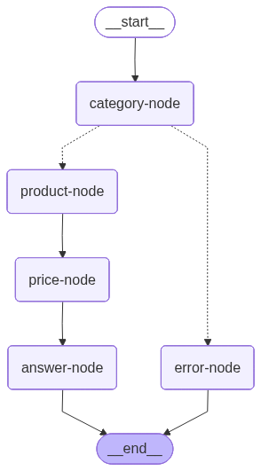

# Chatbot to help digital illiterates find the best prices in retail stores

The objective on this repository is to create a proof of concept on a chatbot to help people without knowledge on price search in the internet. The idea is use Langchain and Langgraph to build a chain of instructions to a LLM and give good outputs to the user.

The final Langgraph Architeture on the project is:

Explanation:
* Category Node: First node, identify if the query from the user is valid and witch category it can be classified; 
* Error Node: Simple error message, if the category classified is invalid;
* Product Node: Product Identifier to price web search;
* Price Node: Price web search;
* Answer Node: Final node to add url source to final answer.

# Launch locally

If your docker compose version is above v2, it is better to up the ollama first and after de application. Anyway, if you are having problems with building, try it.