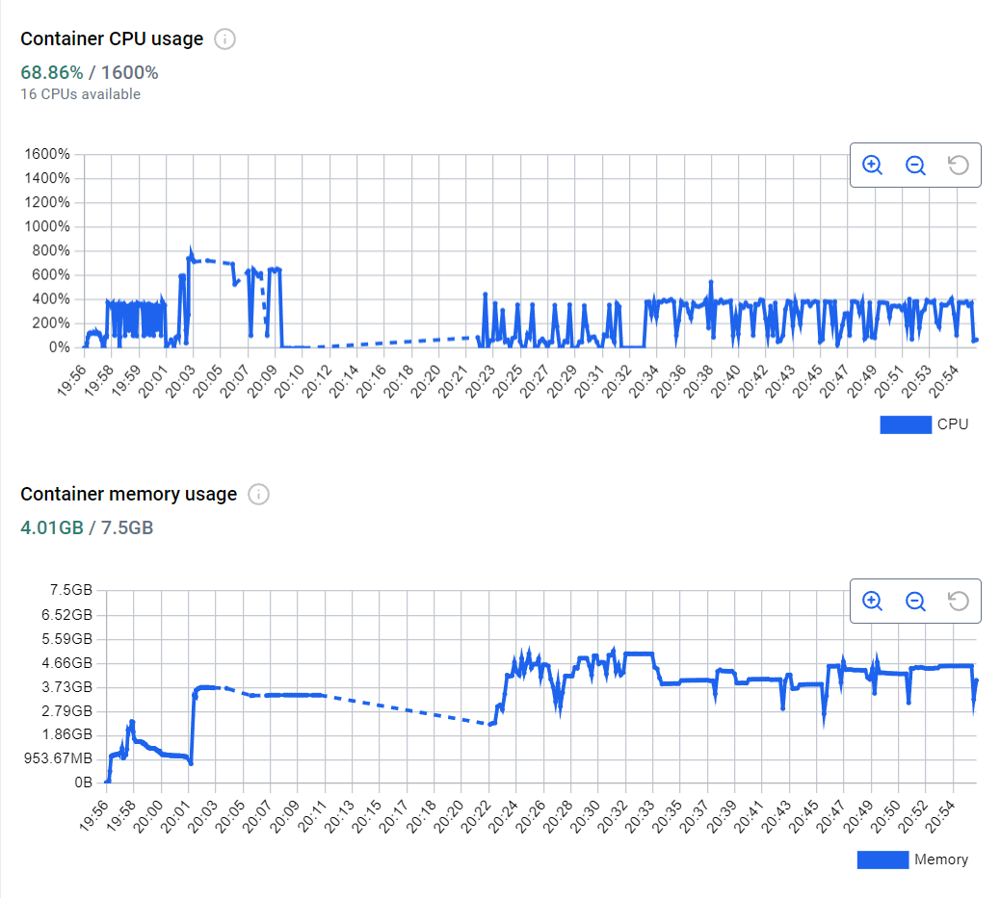

# RAG system Evaluation

To evaluate the RAG system for pricing and possible use in a WhatsApp bot, the RAGAS library was used.

However, due to the small configuration of the computer used for evaluation, it is worth noting that many of the metrics were impossible to evaluate. Although the preparation environment for the test is available, the machine used is available (here) [https://www.amazon.com.br/Notebook-Legion-R7-5800H-RTX3050-82QJ0000BR/dp/B09PZGR4MR]

The resources spent during the evaluation execution were:

Evaluation table from my local computer can be saw [``here``](dataset/evaluation.csv)!

Finally, the system was never intended to achieve the best performance in RAG, since the goal is to obtain a large database from price demands. In this way, the developed system is able to be precise, although it does not have optimal quality in data acquisition. Ultimately, by looking for better APIs for price searching, with stronger models, it would be possible to use an even more robust system that could meet the needs of the digitally illiterate population.